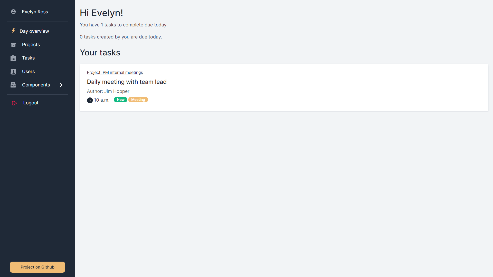
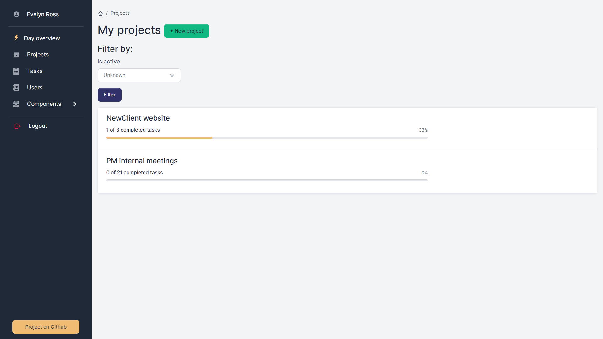
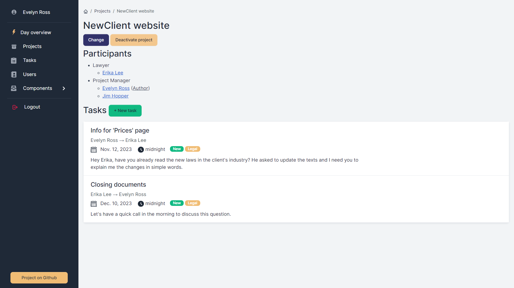
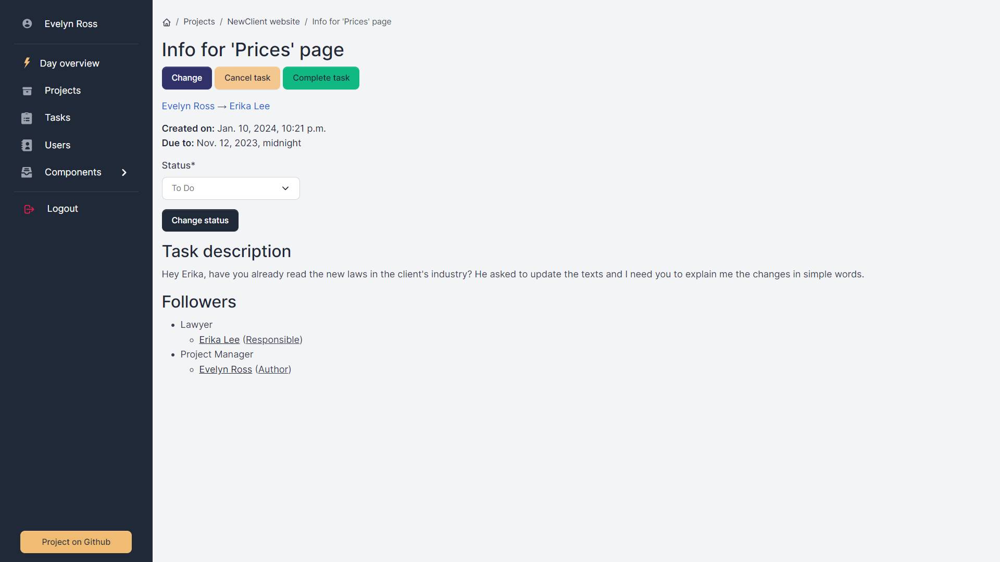
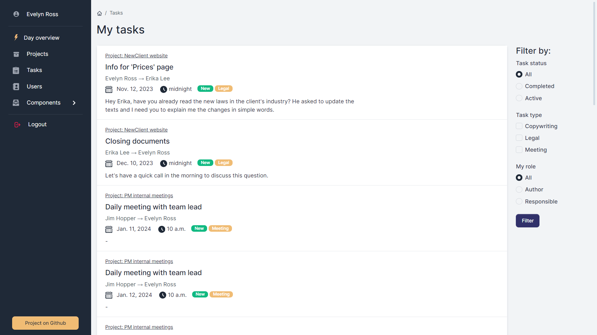
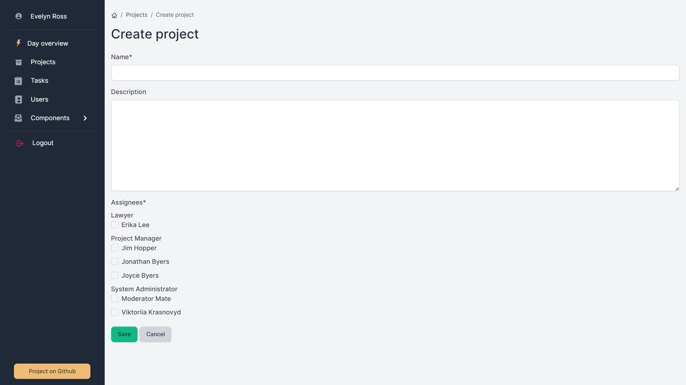
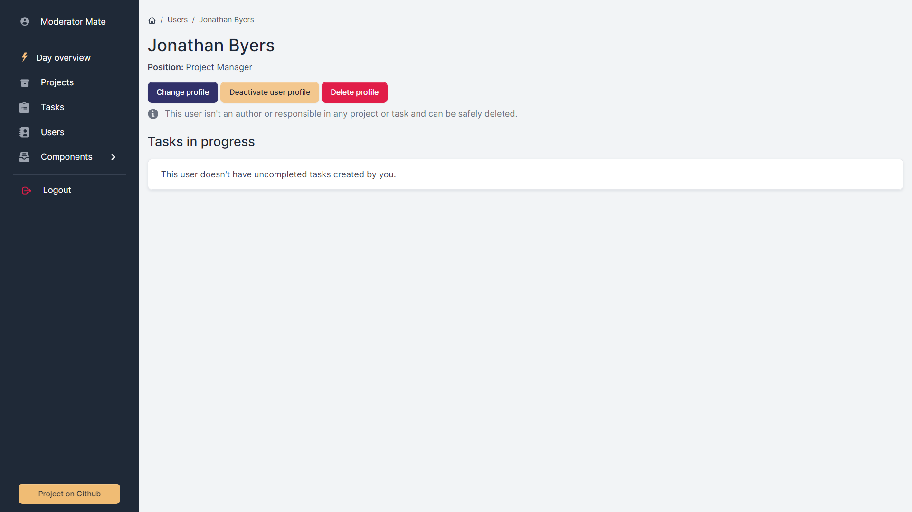
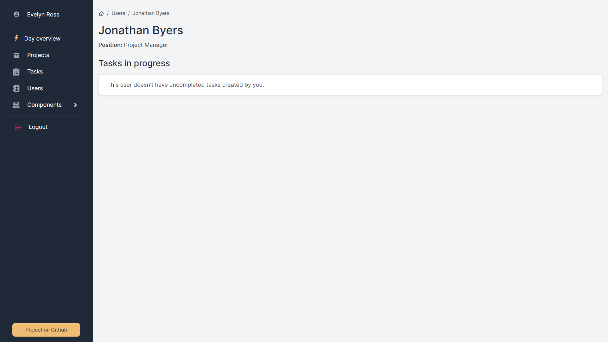

# Project management platform

Task management tool for teams. Supports teaming of employees to work together on projects.

## Table of Contents
1. [ Introduction. ](#introduction)
2. [ Features. ](#features)
3. [ Technologies Used. ](#technologies-used)
4. [ DB Structure. ](#db-structure)
5. [ Getting Started. ](#getting-started)
6. [ Shutdown ](#shutdown)
7. [ Usage. ](#usage)
8. [ Accessing the Application. ](#accessing-the-application)
9. [ Demo. ](#demo)
10. [ Contributing. ](#contributing)

## Introduction

The Project management platform is a web application designed to help an IT-team coordinate and collaborate on projects by providing a shared platform.

Users can create and assign tasks to team members, ensuring clear responsibilities and deadlines are established for each project component. The system has a user-friendly interface for displaying and filtering tasks, which facilitates effective collaboration.

## Features

- Grouping tasks and users: Tasks are created inside projects for clear structure. Project author selects the users that will be working on the project and its tasks. Projects and tasks are visible only to their followers.
- Roles in the task: The actions available in a task depend on the user's role (author, responsible, or performer).
- Day overview: Home page contains lists of tasks to do and to control today.
- Filter Functionality: The system allows you to filter projects and tasks based on various criteria.
- Task status toggle: In two clicks, change the status of a task so that other assignees can easily track its progress.
- Active common tasks: If you created tasks for a user, or they created them for you, they will be displayed in their profile.
- Breadcrumb for quick navigation.

## Technologies Used

- Python and Django Framework for the backend
- HTML, CSS, and JavaScript for the frontend
- SQLite database for data storage

## DB Structure


## Getting Started

### Prerequisites
* Python (version 3.6 or higher) and pip installed on your system
* Git (optional, for cloning the repository)

### Installation
1. Clone the repository:
```
git clone https://github.com/your-username/project-management-platform.git
cd project-management-platform
```

2. Create a virtual environment (optional but recommended):
```
python -m venv env
source env/bin/activate      
# For Windows: env\Scripts\activate
```
3.  Edit the `.env` using the template `.env.sample`.

```
# True for development, False for production
DJANDO_DEBUG=True
```

4. Install dependencies:
```
pip install -r requirements.txt
```

5. Run database migrations:
```
python manage.py migrate
```

6. Create a superuser to access the admin panel:
```
python manage.py createsuperuser
```

7. Start the development server:
```
python manage.py runserver
```

8. Open your web browser and navigate to http://localhost:8000/.

## Shutdown
To stop running app in your terminal press:
```
ctrl + C
```

## Usage
- Users can log in to their accounts, create projects and tasks and assign other users to them.
- While creating a project or task, the author gets automatically assigned as the assignee/follower of the corresponding project or task.
- The system will maintain records of users, projects and tasks, providing easy access to their key data.

## Accessing the Application
- The Django application is accessible at http://localhost:8000/
- The Admin page can be accessed at http://localhost:8000/admin

Remember to replace `localhost` with the relevant IP address if you're not accessing these from the same machine where the services are running.

## Demo








User profile: Action buttons are isvisible only for staff members.



## Contributing
I welcome contributions to improve the Newspaper Redactor Tracking System. Feel free to submit bug reports, feature requests, or pull requests to `v.krasnovyd@gmail.com`
